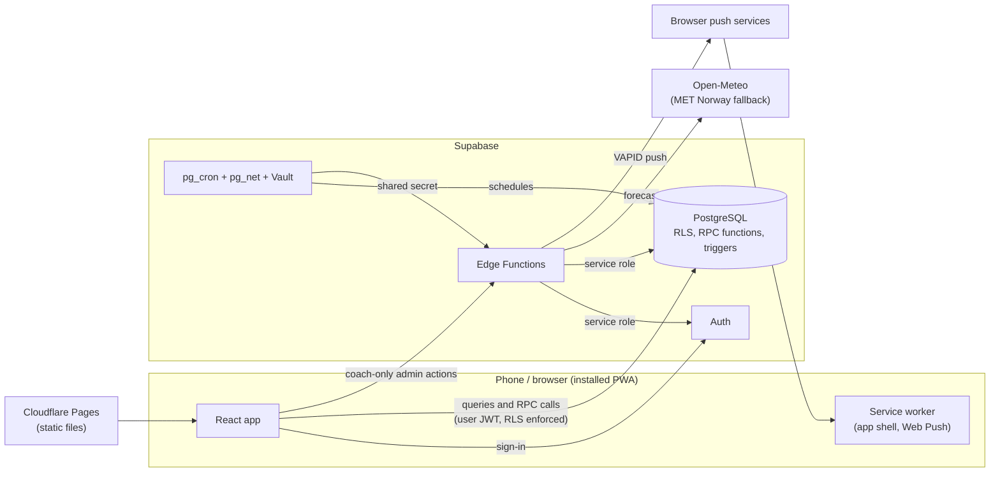

# YSK — Rowing Club Management App

[](https://github.com/storissu/yenimahalle-kurek/actions/workflows/ci.yml)

A private, installable web app (PWA) that runs the day-to-day training life of a rowing club: who is coming, which boat
each person rows in and at what time, who actually rowed, and how many sessions everyone has done this month.

Built for **Kdz. Ereğli Yeni Mahalle Kürek Kulübü** (Turkey). The interface is **Turkish only**; this document and the
code comments are in English.

> **Status:** actively developed. The app is feature-complete for the club's needs and is being prepared for a pilot
> with real members and coaches (see [`docs/PILOT.md`](docs/PILOT.md)).

## The problem

Training information used to live in chat messages: the start time, who answers "yes", which boat each person is in,
and who really showed up. Boats do not start at the same time and a crew has a fixed seating order, so a plain list is
not enough. YSK keeps that in one place, gives every member a clear view of *their own* session, and saves coaches the
manual bookkeeping.

## Who uses it

| Role | What they do |
|---|---|
| **Member** | Answers *Katılıyorum / Katılmıyorum* for a training, sees the published program with **their own boat, time and crew first**, gets notifications, checks the weather for their session, and browses other members, their own history and the monthly leaderboard. |
| **Coach** | Creates trainings, builds and publishes the boat program, records attendance, manages members, and sees the change history. |

Accounts are created by coaches (no public sign-up). Members log in with a **username**, not an e-mail address.

## Screenshots

> Placeholders — add your own screenshots (use sample data only, never real member names or phone numbers) to
> `docs/screenshots/` and adjust the file names below.

| Member | Coach |
|---|---|
|  |  |
|  |  |
|  |  |

## Features

**Trainings and answers**
- Coaches create, edit and cancel trainings. Cancelling may include an optional reason; it is shown only under *Antrenmanlar*.
- Answer deadline chosen as 12 / 24 / 48 hours before, *the evening before at 20:00*, or a custom time. Deadlines are
  enforced by the **database clock**, so a wrong phone clock cannot re-open them.
- Members can leave the coach a short note with their answer; coaches can answer on a member's behalf.

**Boat program**
- **Independent schedule per boat**: each boat has its own sessions (one hour by default, any length possible), so
  Mavi can start at 08:00, Turuncu at 08:15 and C4X at 08:30.
- **Crew assignment** with rules enforced in the database: a boat is used once per session, nobody is in two boats at the same
  time, capacity is respected.
- **Preserved crew order**: the order the coach sets is the seat order in the boat (1 = first seat) and is shown to
  members with numbered chips; it is never re-sorted alphabetically.
- **C4X = 4 rowers + a separate coxswain (Dümenci)**: the coxswain is a distinct role (a member or the coach), not a fifth
  seat, and a C4X cannot be published without exactly four rowers and a coxswain.
- Draft / publish workflow. Publishing locks answers and notifies the people affected; later updates notify only those
  whose session changed.

**Attendance, history and statistics**
- Coaches record who actually rowed **per session**, starting from the planned crews and adding walk-ins; completing a
  training feeds the statistics.
- Members see their own training history and the sessions they **rowed in the same boat** as another member.
- Monthly statistics and **leaderboard** (per one-hour session, ties share a place, resets each calendar month);
  coaches get per-member history and CSV exports.

**Weather**
- A small forecast card shows the weather for the member's **own session date and start time** (wind, gusts, waves, rain),
  labelled with that date and time, plus the update time and data source.
- Coaches can set gust/wave warning thresholds. The app only informs; it never cancels a training by itself.

**Notifications**
- In-app inbox with unread badge, plus **Web Push**: new training, changes and cancellations, a reminder for members
  who have not answered, a coach summary after the deadline, and a personal "your boat, your time, your crew" message
  when a program is published.

**Member management and accountability**
- Coaches add members (username + one-time password), reset passwords, deactivate/reactivate, **change a role**
  (Member ⇄ Coach), edit phone numbers and delete accounts (history is kept anonymously as "Eski üye").
- A **change history** records who changed what and when. Passwords and phone numbers are never written to it.

**Quality of life**
- Installable PWA, light/dark theme, in-app help (FAQ for members and for coaches), offline-aware UI, accessibility
  checks in CI.

## Tech stack

| Area | Technology |
|---|---|
| Frontend | React 19, TypeScript, Vite, React Router 7, TanStack Query, react-hook-form + zod, Tailwind CSS 4, lucide-react |
| PWA | `vite-plugin-pwa` (injectManifest) with a custom service worker (Workbox) for app-shell caching, Web Push and notification routing |
| Backend / data | Supabase: PostgreSQL with Row Level Security, Auth, Edge Functions (Deno / TypeScript), `pg_cron`, `pg_net`, Vault |
| Notifications | Web Push (VAPID) sent from an Edge Function using `web-push` |
| Weather | Open-Meteo forecast and marine APIs, MET Norway as fallback (fetched server-side) |
| Hosting | Cloudflare Pages (static site, security headers in `web/public/_headers`) |
| Testing | Vitest, Testing Library, happy-dom, PGlite (in-process Postgres), Playwright + axe-core |
| Tooling | ESLint + typescript-eslint, GitHub Actions (CI, keep-alive, encrypted backup), Dependabot |

## Architecture



- The app talks to Supabase directly for reads and for **RPC functions** (`save_program`, `save_attendance`, `set_rsvp`,
  `cancel_training`, `set_member_role`, ...). Every rule that matters lives in the database.
- **Edge Functions** cover what a browser must never do: create accounts, reset passwords, (de)activate and delete
  members (`admin-*`), fetch the forecast (`refresh-weather`) and deliver push messages (`send-notifications`).
- **Scheduled jobs run inside Supabase** (no server to maintain): reminders every 5 minutes, push delivery, and a
  forecast refresh every 3 hours.
- The weather is fetched server-side and cached per session, so a provider outage never breaks a page.

## Key technical decisions

- **The database is the authority.** Row Level Security is on every table with default-deny; clients get explicit
  column-level grants; state changes go through `SECURITY DEFINER` functions that pin their `search_path`. Tests compare
  every grant and function against a reviewed snapshot, so an accidental change fails the build.
- **Authentication and roles.** No public sign-up. Usernames map to a synthetic e-mail for Supabase Auth. The role is
  read from `profiles` on every request (not stored in the token), so a role change takes effect immediately; a trigger
  protects the last active coach. Route guards in the client are UX only.
- **Session model.** A boat session has its own start/end and a stable session number that attendance, history,
  weather and statistics all join on. Times are stored as UTC and shown in the club's time zone (Europe/Istanbul).
- **Attendance is separate from answers and from the plan.** What actually happened is its own record, so history and
  statistics stay correct even if the program is edited later. Only completed trainings count, bucketed by month.
- **Notifications through an outbox.** One table is both the inbox and the push queue, with a unique key per event so
  retries never send twice. Push is best-effort; the inbox is the guarantee.
- **Real migrations in tests.** Database rules are tested by running the actual migration files on PGlite, an
  in-process Postgres, so no Docker or cloud project is needed to run them.
- **Zero-budget operation.** Free tiers only, with a keep-alive workflow and a weekly encrypted backup as safety nets.

More detail: [`docs/ARCHITECTURE.md`](docs/ARCHITECTURE.md), [`docs/SECURITY.md`](docs/SECURITY.md).

## Project structure

```
.
├── web/                    React + Vite + TypeScript PWA
│   ├── src/
│   │   ├── features/       attendance, audit, auth, boats, help, install, members, notifications,
│   │   │                   program, settings, stats, theme, trainings, weather
│   │   ├── pages/          coach/, member/, shared/ screens
│   │   ├── components/     layout/ and ui/ building blocks
│   │   ├── lib/            Supabase client, time, env, push, CSV helpers
│   │   ├── strings/        all Turkish UI text
│   │   └── sw.ts           service worker
│   ├── e2e/                browser smoke test (mocked backend, axe scans)
│   └── public/             icons, security headers (_headers)
├── supabase/
│   ├── migrations/         PostgreSQL schema, RLS, functions, triggers, schedules
│   ├── functions/          Edge Functions (admin-*, refresh-weather, send-notifications, push-test) + _shared/
│   ├── tests/              database rule tests (PGlite)
│   └── config.toml
├── scripts/                operator scripts (first coach, deployed-site preflight check, secret scan)
├── docs/                   architecture, security review, runbook, pilot plan, accessibility, Turkish guides (tr/)
└── .github/workflows/      ci.yml, keepalive.yml, backup.yml
```

## Local development

**Prerequisites:** Node.js 22+ and npm. Docker is **not** required. To run the app against real data you also need a
free [Supabase](https://supabase.com) project.

```bash
# 1. Install and configure the web app
cd web
npm install
cp .env.example .env.local        # then fill in the values described below

# 2. Run it
npm run dev                       # development server

# 3. Build and preview a production build
npm run build                     # typecheck + Vite build + service worker
npm run preview
```

Quality checks (all run in CI):

```bash
cd web && npm run lint && npm run typecheck && npm test      # app: lint, types, unit/component tests
cd supabase/tests && npm install && npm test                 # database rules (real migrations on PGlite)
cd web && npm run e2e                                        # browser smoke test against a preview build
                                                             # (needs a build served on port 4173, see docs/RUNBOOK.md)
```

**Supabase setup** (once per project; the full step-by-step guide is [`docs/RUNBOOK.md`](docs/RUNBOOK.md)):

1. Create a Supabase project. In Auth settings: e-mail provider on, **confirm e-mail off**, **sign-up off**.
2. `npx supabase login`, `npx supabase link --project-ref <ref>`, then `npx supabase db push` to apply the migrations.
3. Generate a Web Push key pair (`cd scripts && npm install && npm run vapid`) and set the Edge Function secrets
   listed below with `npx supabase secrets set`, then `npx supabase functions deploy`.
4. Store the project URL and the cron secret in Supabase Vault so the scheduled jobs can call the functions.
5. Create the first coach with `scripts/bootstrap-coach.mjs` (there is deliberately no sign-up screen).

## Environment variables

Use placeholders only in documentation and never commit real values. `.env*` files are git-ignored except `web/.env.example`.

**Web app** (`web/.env.local`, prefixed `VITE_`; these are public by design because they ship in the browser bundle):

| Variable | Required | Purpose |
|---|---|---|
| `VITE_SUPABASE_URL` | yes | `https://<project-ref>.supabase.co` |
| `VITE_SUPABASE_ANON_KEY` | yes | Supabase anon / publishable key (safe in the browser; RLS protects the data) |
| `VITE_VAPID_PUBLIC_KEY` | for push | Web Push **public** key; without it the app works but notifications stay off |
| `VITE_LOGIN_EMAIL_DOMAIN` | no | Domain used to turn usernames into e-mails (default `kulup.invalid`); must match the function secret |
| `VITE_FEEDBACK_URL` | no | `https://` link behind the "Görüş bildir" button |

**Edge Function secrets** (`npx supabase secrets set ...`; never put these in the web app or the repository):

| Secret | Purpose |
|---|---|
| `LOGIN_EMAIL_DOMAIN` | same value as the web variable above |
| `ALLOWED_ORIGIN` | exact site origin allowed to call the functions (CORS is fail-closed) |
| `VAPID_PUBLIC_KEY`, `VAPID_PRIVATE_KEY`, `VAPID_SUBJECT` | Web Push signing |
| `CRON_SECRET` | shared secret between the scheduled jobs and the functions |
| `WEATHER_USER_AGENT` | optional identifying string for the weather providers |

`SUPABASE_URL`, `SUPABASE_ANON_KEY` and `SUPABASE_SERVICE_ROLE_KEY` are provided to the functions by Supabase itself.
The service-role key is only ever used server-side and by the one-off bootstrap script.

**GitHub Actions secrets** (only for the optional keep-alive and backup workflows): `SUPABASE_URL`, `SUPABASE_ANON_KEY`,
`SUPABASE_DB_URL`, `BACKUP_PASSPHRASE`.

## Installing as a mobile app (PWA)

YSK is a Progressive Web App, so no app store is involved.

- **Android (Chrome):** open the site, menu **⋮ → Install app**.
- **iPhone (Safari, iOS 16.4+):** open the site in Safari, tap **Share → Add to Home Screen**, and open the app from the
  new icon. Push notifications on iPhone only work when the app is opened from the home-screen icon.
- Turn notifications on in the app (**Profil → Bildirimleri aç** for members, **Diğer → Bildirimleri aç** for coaches).
- The service worker caches only the app shell; API responses are never cached, and saving while offline fails
  immediately with a clear message instead of queuing silently.

## Documentation

| Document | Contents |
|---|---|
| [`docs/ARCHITECTURE.md`](docs/ARCHITECTURE.md) | Design decisions, data model rules, notification and weather flow |
| [`docs/SECURITY.md`](docs/SECURITY.md) | Threat model and checklist with the tests that keep each item true |
| [`docs/RUNBOOK.md`](docs/RUNBOOK.md) | Setup and operations, step by step |
| [`docs/PILOT.md`](docs/PILOT.md) | Pilot and rollout plan |
| [`docs/ACCESSIBILITY.md`](docs/ACCESSIBILITY.md) | What is checked automatically and the manual checklist |
| [`docs/tr/`](docs/tr) | Turkish member guide, coach guide and invitation texts |

## Author

**Öykü Su Kodaş** — Computer Engineering
Design and development: [github.com/storissu](https://github.com/storissu)

## License and usage

This repository is public for **portfolio and code-review purposes**. It is a real application built for a specific
club, and **no open-source license is granted**: all rights are reserved by the author. You are welcome to read the code
and learn from it; please do not copy, redistribute or deploy it as your own without permission.

The repository contains **no club data**: no member names, phone numbers, accounts or credentials. Names, numbers and
dates in tests and screenshots are sample data.
